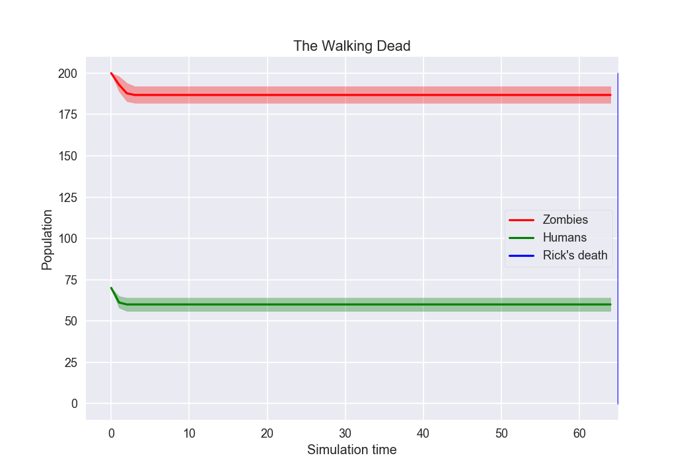
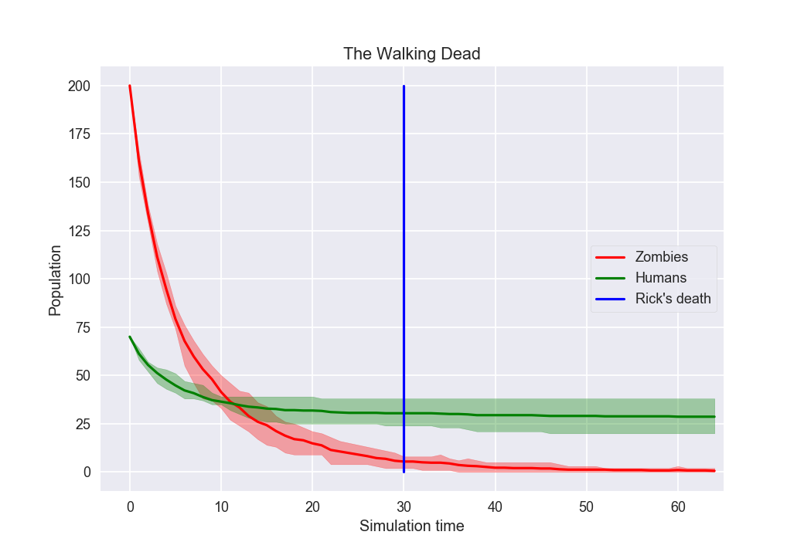

# Agent Based Simulation Of The Walking Dead

## Introduction

> Executive producer David Alpert said in 2014 that the original comics have 
given them enough ideas for Rick Grimes and company over the next seven years.
 
<a href="https://en.wikipedia.org/wiki/The_Walking_Dead_(TV_series)#Future_seasons" target="_blank">https://en.wikipedia.org/wiki/The_Walking_Dead_(TV_series)#Future_seasons</a>

By the time of writing, this is 3 years ago. Given 16 eposides p.a. this 
promises another ~64 episodes to come. This agent based simulation answers 
the question whether there will be enough humans left for another 64 eposiodes. 

## The agent based model framework
There exists a framework called [nxsim](https://github.com/kentwait/nxsim) 
out there but is is not doing what I expected it to do. So I came up with my 
own Framework. It basically consists of two classes:

* `abm.Environment` ([environment.py](abm/environment.py))
* `abm.Agent` ([agents.py](abm/agents.py))

The `Environment` class is wrapped around a `nx.Graph`. It can set Agents on 
nodes and traverse the node topology executing different operations (`EnvironmentOperable`) on each 
node.

An `Agent` is an object that can be placed on the node of a Graph (via it's 
`Environment`). Any Agent has a method `do` which can be overridden to 
implement the agents behavior within it's `Environment`.

An `EnvironmentOperable` ([environment.py](abm/environment.py)) is an object with is executed on each node when the 
environments topology is traversed. It can have a `preprocess` and a 
`postprocesse` method which are executed before and after the traversal of 
the topology.

A concrete implementation of `EnvironmentOperable` which might be used often 
in the context of the agent based simulation is the `AgentExecutor` 
([operations.py](abm/operations.py)). Its fetches the `Agent` from a 
node and calls it's `do` method (causing it to do whatever it is supposed to 
do).
 
## Using the framework
The walking dead scenario is a perfect example on how to use my framework. 
Using the framework consists of the following (generally spoken) steps:

1. implement a concrete environment (which derives from `abm.Environment`): 
in my case, this is `abm.wd.WalkingDeadEnv` ([environment.py](abm/wd/environment.py)). Note that the concrete environment has a 
`setup` method for generating the environments topology. In addition, it has 
a method called `runSimulation` which basically instanciates some 
`EnvironmentOperable` used by `traverseTopology`.
 
1. implement different concrete agents (deriving 'Agent') and override their 
behavior. In my case, the concrete agents ([agents.py](abm/wd/agents.py)) are: 

   1. `Rick`: whenever there are zombies in his neighborhood, rick swaps node 
   with the human neighbor who is surrounded by the least amount of zombies. 
   First, rick tries to find an enemy fullfilling this requirement. If there 
   are no enemies in his neighborhood, he doesn't hesitate to sacrifice a 
   friend ...
    
   1. `FriendOfRick`: they basically try to stay close to rick. When they are
    seperated from him, they try to find a common neighbor they can swap node
     with. If there is one, they swap. If not, they are lost and try to fight
      on their own ...
   
   1. `EnemyOfRick`: they just hang around and fight whenever they are 
   attacked by zombies
   
   1. `Zombie`: whenever there is a human in their neighborhood, they try to 
   eat him. I implemented different kinds of zombies for different scenarios:
    `Zombie`, `KillableZombie`, `MovingKillableZombie`.
     
1. implements operations you want to perform on node traversal: Sometimes, 
the `AgentExecutor` is sufficient. However, in my example, I had to collect 
data to interpret the result. Therefore I implemented a ([DataCollector](abm/wd/stats.py)) which basically counts to number of humans/zombies after 
each iteration. The collected data is finally used by ([Plotter](abm/wd/plot.py)) to generate my plots.

**Note**: I put all settings into (settings.py) to have it separated from the 
rest of the code.
     
## Results
Just in case you are interested in - these are the results of running my 
simulation for 64 timesteps (assuming 64 episodes where there are fights 
between humans and zombies in each episode):

### Immortable Zombies

In this case, humanity will not live long. Rick dies after around 3 episodes 
and all humans are dead after around 5 episodes.

### Killable Zombies

There is a fight between zombies and humans but eventually it comes to a rest
. This could be explained by the fact that humans killed all zombies they are
 connected to. Rick lives happily ever after.

### Moving Killable Zombies

Even though there are less humans than zombies, humans will distinct all 
zombies. Rick will die anyway but it will take pretty much all 64 iterations 
to kill all zombies. Few humans are left in the end ...

## Open issues
I tried to keep the main framework as clean and general as possible. Just in 
case anyone likes to reuse it. However, the concrete implementation is a 
little quick'n'dirty in some ways, namely the global settings are just 
imported into some classes where they should probably be set as parameters. 
In addition, I restricted typehinting to primitives because I got circular 
imports when trying to define parameters of my own objects.